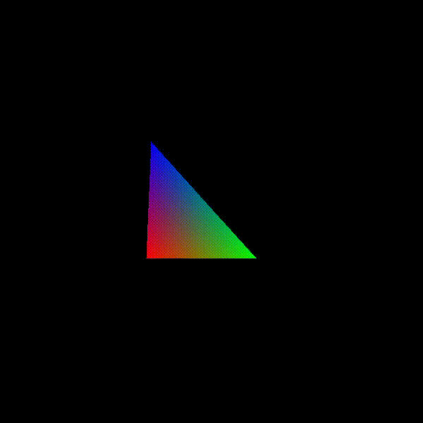

A software rasterizer I am writing from scratch (window/input management through SDL2).

3D frustum clipping working for left/right/top/bottom planes. Some bug for special cases with near/far planes that I have to think about. I've realized that implementing frustum clipping is not a trivial task, and may explain the lack of resources on the subject in CG books and online.

Working on 3D frustum clipping:

Camera controls:

Asset support (vertex + index buffers w/ concatenation between assets)

Basic line drawing and projection:

