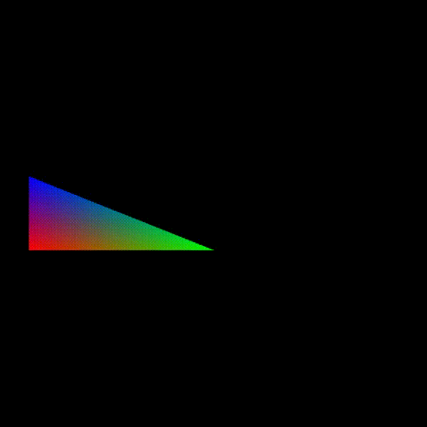

A software rasterizer I am writing from scratch (window/input management through SDL2).

Working on 3D frustum clipping:

Camera controls:

Asset support (vertex + index buffers w/ concatenation between assets)

Basic line drawing and projection:

