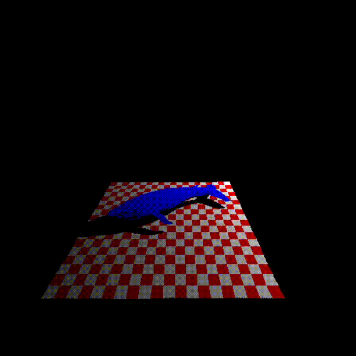
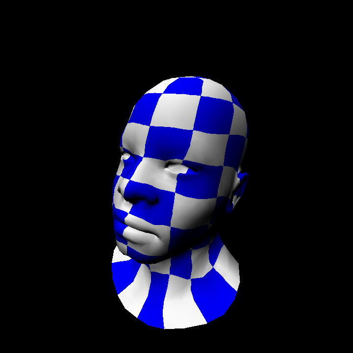
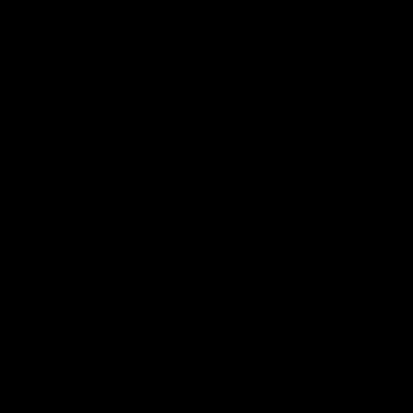

A software rasterizer I am writing from scratch (window/input management through SDL2, and OBJ loading using https://github.com/Bly7/OBJ-Loader)

Shaddow mapping working. I will be taking a break from this project and work on
implementing a pipeline in Vulkan.

Working on texturing:

Full-face Clipping, fragment shader:

Clipping:

Camera:

Line drawing and projection:

